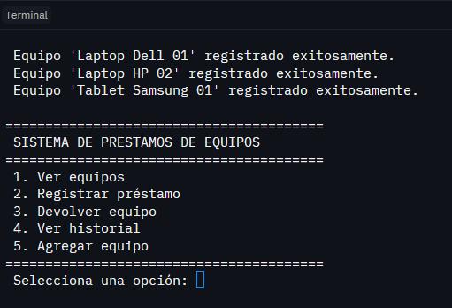
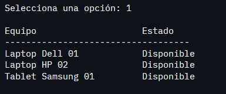
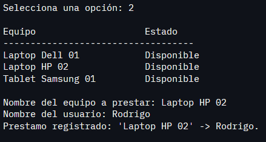
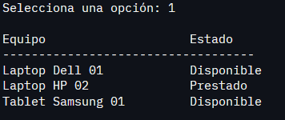
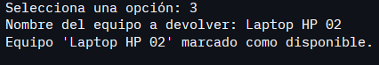
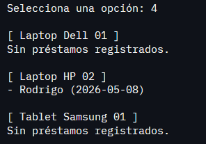
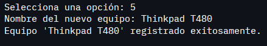
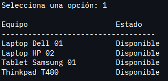

# Sistema de Préstamos de Equipos

Aplicación de consola en Python para gestionar el inventario, préstamos y devoluciones de equipos de cómputo en una institución.

---

## Diseño de Clases

El sistema usa dos clases con responsabilidades separadas, más una función `menu()` que actúa como punto de entrada.

### `Equipo`

Representa un equipo individual del inventario. Encapsula su propio estado y valida las operaciones que le conciernen directamente.

```
Equipo
nombre: str
disponible: bool
historial: list[tuple[str, str]] ← lista de tuplas (usuario, fecha)

prestar(usuario: str) -> None
devolver() -> None
estado_str() -> str
```

**Por qué las validaciones viven aquí y no en `SistemaPrestamos`:**
La regla "un equipo no puede prestarse si ya está prestado" pertenece al equipo, no al sistema que lo administra. Si esa lógica viviera en `SistemaPrestamos`, cualquier otro componente podría modificar el estado del equipo saltándose la validación.

**Estructuras de datos aplicadas:**
- `historial` es una `list` que almacena los registros ordenados cronológicamente.
- Cada registro es una `tuple` inmutable `(usuario, fecha)`. Inmutable porque un préstamo ya registrado no debe poder modificarse.

---

### `SistemaPrestamos`

Gestiona el inventario completo. Coordina los equipos y contiene la lógica de cada flujo de usuario (mostrar, registrar, devolver, agregar).

```
SistemaPrestamos
inventario: dict[str, Equipo] ← diccionario anidado nombre -> objeto Equipo

agregar_equipo(nombre: str) -> None
mostrar_equipos() -> None
registrar_prestamo() -> None
devolver_equipo() -> None
ver_historial() -> None
```

**Estructura de datos aplicada:**
- `inventario` es un `dict` con el nombre del equipo como clave y el objeto `Equipo` como valor. Permite acceso O(1) por nombre y centraliza todo el inventario en una sola estructura.

---

### `menu()` — función standalone

No es una clase. Su única responsabilidad es instanciar `SistemaPrestamos`, mostrar las opciones y despachar la acción correspondiente. Separar la UI de la lógica permite cambiar la interfaz (por ejemplo, a una API o interfaz gráfica) sin tocar las clases.

---

## Ejemplos de Ejecución

### 1. Ejecución inicial — menú principal

Al correr el programa se cargan tres equipos de ejemplo y se muestra el menú.



---

### 2. Ver equipos disponibles

Muestra el inventario completo con el estado de cada equipo.



---

### 3. Registrar un préstamo

El sistema muestra los equipos disponibles, solicita el nombre del equipo y el nombre del usuario, y confirma el registro.



---

### 4. Ver equipos después del préstamo

El equipo prestado aparece ahora con estado **Prestado**.



---

### 5. Devolver un equipo

Se ingresa el nombre del equipo y el sistema lo marca como disponible nuevamente.



---

### 6. Ver historial de préstamos

Muestra todos los registros históricos por equipo, incluyendo usuario y fecha. Los equipos sin préstamos lo indican explícitamente.



---

### 7. Agregar un nuevo equipo

Se ingresa el nombre del nuevo equipo. El sistema valida que no exista antes de registrarlo.



---

### 8. Ver equipos después de agregar

El nuevo equipo aparece en el inventario con estado **Disponible**.


